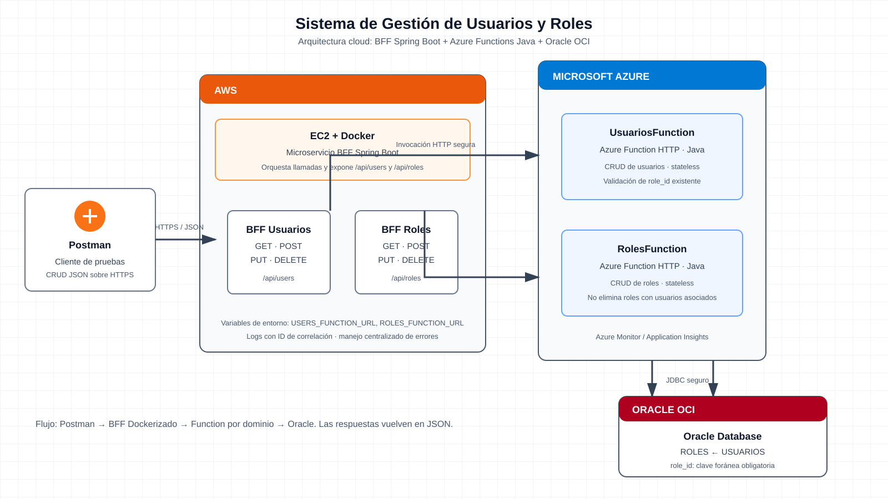

# Diseño — Sistema de Gestión de Usuarios y Roles

## Arquitectura

El sistema no tendrá frontend. Postman será el cliente de prueba y consumirá un BFF desarrollado con Spring Boot, desplegable en un contenedor Docker sobre EC2. El BFF orquesta llamadas HTTP hacia dos Azure Functions Java: una para usuarios y otra para roles. Ambas funciones se conectan a Oracle OCI.



## Responsabilidades

| Componente | Responsabilidad |
|---|---|
| Postman | Ejecutar pruebas CRUD y visualizar respuestas JSON. |
| BFF Spring Boot | Exponer una API única, validar solicitudes básicas, propagar el ID de correlación e invocar la función del dominio correspondiente. |
| `UsuariosFunction` | Crear, consultar, actualizar y eliminar usuarios; validar que el rol asociado exista. |
| `RolesFunction` | Crear, consultar, actualizar y eliminar roles; impedir eliminar un rol que tenga usuarios asociados. |
| Oracle OCI | Persistir usuarios y roles, incluyendo la relación obligatoria entre ambos. |

## API del BFF

Todas las respuestas son JSON. Los errores usarán el formato `{ "timestamp", "status", "code", "message", "correlationId" }` y no incluirán secretos, URLs internas ni trazas.

### Roles

| Operación | Ruta | Entrada | Respuesta exitosa |
|---|---|---|---|
| Crear | `POST /api/roles` | `{ "name", "description" }` | `201` y rol creado |
| Listar | `GET /api/roles` | — | `200` y arreglo de roles |
| Consultar | `GET /api/roles/{id}` | — | `200` y rol |
| Actualizar | `PUT /api/roles/{id}` | `{ "name", "description", "active" }` | `200` y rol actualizado |
| Eliminar | `DELETE /api/roles/{id}` | — | `204`; `409` si tiene usuarios asociados |

Ejemplo de rol:

```json
{ "id": 1, "name": "ADMIN", "description": "Administración total", "active": true }
```

### Usuarios

| Operación | Ruta | Entrada | Respuesta exitosa |
|---|---|---|---|
| Crear | `POST /api/users` | `{ "fullName", "email", "roleId" }` | `201` y usuario creado |
| Listar | `GET /api/users` | — | `200` y arreglo de usuarios |
| Consultar | `GET /api/users/{id}` | — | `200` y usuario |
| Actualizar | `PUT /api/users/{id}` | `{ "fullName", "email", "roleId", "active" }` | `200` y usuario actualizado |
| Eliminar | `DELETE /api/users/{id}` | — | `204` |

Ejemplo de usuario:

```json
{ "id": 10, "fullName": "Ana Pérez", "email": "ana.perez@empresa.cl", "roleId": 1, "active": true }
```

## Flujo de una operación

1. Postman invoca una ruta `/api/users` o `/api/roles` del BFF.
2. El BFF genera o propaga `X-Correlation-Id`, valida la solicitud y llama a la Azure Function del dominio.
3. La función ejecuta la operación en Oracle OCI mediante una conexión configurada por variables de entorno.
4. La función registra resultado y correlación en Azure Monitor/Application Insights.
5. El BFF devuelve el estado HTTP y JSON de la operación al cliente.

## Calidad y seguridad

- Las funciones son pequeñas, sin estado y exclusivamente responsables de su dominio.
- Las URLs de las funciones y credenciales Oracle se configuran mediante variables de entorno; nunca se almacenan en código ni en Git.
- Cada solicitud queda trazable con un ID de correlación.
- Se validan campos obligatorios, correos únicos y existencia del rol antes de crear o modificar un usuario.
- Se aplican límites de tiempo, logs estructurados y respuestas controladas ante errores.
